<!-- Generated from profile.json by scripts/make_readme.py. -->

<h3>Pushpraj Patil</h3>

Engineering Student &amp; Developer · Talegaon, Pune

<a href="https://patilpushpraj39-lang.github.io/pushpraj-portfolio/">Portfolio</a> &nbsp;·&nbsp; <a href="https://www.linkedin.com/in/pushpraj-patil-aa7320328">LinkedIn</a> &nbsp;·&nbsp; <a href="mailto:patilpushpraj39@gmail.com">Email</a> &nbsp;·&nbsp; <a href="https://www.instagram.com/_the_pushpraj_patil__/">Instagram</a>

 
<h3><code>pushpraj@github ~ $ ./contributions.sh</code></h3>

  
<h3><code>pushpraj@github ~ $ whoami</code></h3>
<table role="presentation"><tr>
<td valign="top"></td>
<td valign="top"></td>
</tr></table>
 

I&#x27;m an engineering student and developer exploring the space between technology and design. I enjoy turning ideas into thoughtful digital experiences through web development, AI, and interactive design.

<h3><code>pushpraj@github ~ $ ls projects/</code></h3>
<table>
<tr><th align="left">Project</th><th align="left">About</th><th>Explore</th></tr>
<tr><td><strong>Cafe D&#x27; Cruze</strong></td><td>A modern café website designed to present the brand, menu and atmosphere through a clean and engaging web experience.</td><td><a href="https://patilpushpraj39-lang.github.io/cafe-d-cruze-v2/">Live</a> · <a href="https://github.com/patilpushpraj39-lang/cafe-d-cruze-v2">Code</a></td></tr>
<tr><td><strong>S-Square Fitness</strong></td><td>A fitness-focused web experience designed around clear content, responsive layouts and an energetic visual identity.</td><td><a href="https://patilpushpraj39-lang.github.io/s-square-fitness/">Live</a> · <a href="https://github.com/patilpushpraj39-lang/s-square-fitness">Code</a></td></tr>
<tr><td><strong>Medicare Reminder AI</strong></td><td>An AI-assisted medication reminder experience focused on making daily medication schedules easier to manage.</td><td><a href="https://patilpushpraj39-lang.github.io/medicare-reminder-ai/">Live</a> · <a href="https://github.com/patilpushpraj39-lang/medicare-reminder-ai">Code</a></td></tr>
<tr><td><strong>Skyline Weather App</strong></td><td>A responsive weather application that presents current weather information through a simple, interactive interface.</td><td><a href="https://patilpushpraj39-lang.github.io/Skyline-Weather-App/">Live</a> · <a href="https://github.com/patilpushpraj39-lang/Skyline-Weather-App">Code</a></td></tr>
</table>

Technology &amp; tools

 

<code>React</code> · <code>TypeScript</code> · <code>Node.js</code> · <code>Python</code> · <code>PostgreSQL</code> · <code>Supabase</code> · <code>OpenAI API</code> · <code>Prompt Engineering</code> · <code>Data Processing</code> · <code>ML Basics</code> · <code>Tailwind CSS</code> · <code>Framer Motion</code> · <code>Three.js</code> · <code>Figma</code> · <code>Git &amp; GitHub</code> · <code>Vite</code> · <code>VS Code</code> · <code>Vercel</code>

 

<code>Build the future.</code>

Profile art inspired by <a href="https://www.avivashishta.com/blog/build-animated-github-profile-readme.html">Avi Vashishta’s guide</a>. Built from my own details, portrait, and GitHub contributions.

